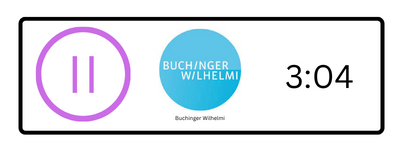

Task:

BACKENDURL: https://timetracker-backend.datafortress.cloud/docs

^ the link above has a nice swagger documentation as well

Create a "timetracker" which has one component for the entry "buchinger" and one entry for "hpe". The logos are in the src folder.

One component should look roughly like this:



Consisting out of four parts:

1. Pause/Play button. This should change on each click
2. The company logo, see /home/jguese/code/timetracker/frontend/src/bw_logo.jpg
3. The company name
4. The time it is running since "Play" was pressed, or "empty string" if "Play" was not yet pressed

## Logic:

0. Grab clients and current status from backend
    - GET '/timer/clients'
        - returns list of string entries (hpe, bw)
    - GET '/timer/info'
        - returns list of "TimeEntryInfos"
        ```
        [
            {
                "customer": "hpe",
                "running": false,
                "start_time": null
            },
            {
                "customer": "bw",
                "running": false,
                "start_time": null
            }
        ]
        ```
    - set the start/pause conditions according to the above info
1. "Not started" component:
    - Play button is visible
    - No timer (right) is shown (empty string)
2. User clicks on "Play"
    - Change play button to pause button
    - remember time when user pressed play
    - send a put request to backend PUT '/timer/start'
        - body
        ```
        {
            "customer": "string",
            "start_time": "2022-11-15T08:55:03.118Z"
        }
        ```
    - show the current passed time on the right side
3. User clicks on "Pause"
    - Change pause button to play button
    - Send request to backend, PUT '/timer/stop'
        - body
        ```
        {
            "customer": "string",
            "end_time": "2022-11-15T08:55:03.120Z"
        }
        ```
    - Remove the time counter and show an empty string instead

Also check for errors, they might tell you what is going wrong. The endpoint returns code 200 if everything went alright